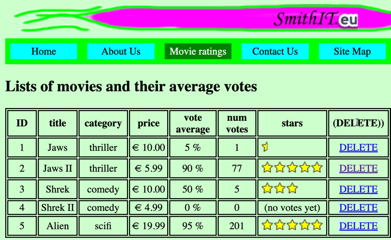

# evote-movie-2020-09-link-delete

We'll add a DELETE button for each Movie row in the list:



- add to `/templates/list.html.twig` a new table column header `(DELETE)`

    ```twig
    <tr>
        <th> ID </th>
        <th> title </th>
        <th> category </th>
        <th> price </th>
        <th> vote average </th>
        <th> num votes </th>
        <th> stars </th>
        <th> (DELETE)) </th>
    </tr>
    ```

- for each Movie table row add to `/templates/list.html.twig` a new link `DELETE`, that is a link to URL `/index.php?action=deleteMovie&id=<ID>`:
    
    ```twig
    
    <tr>
        <td>{{ movie.id }}</td>
        <td>{{ movie.title }}</td>
        <td>{{ movie.category }}</td>
        <td>&euro; {{ movie.price | number_format(2, '.', ',') }}</td>
        <td>{{ movie.voteAverage }} %</td>
        <td>{{ movie.numVotes }}</td>
        <td>
            
                
            
                (no votes yet)
            
        </td>
        <td>
            <a href="/index.php?action=deleteMovie&id={{ movie.id }}">
                DELETE
            </a>
        </td>
    </tr>
    
    ```
    
    - NOTE: we are passing 2 GET variables in this link `action=deleteMovie` and `id={{ movie.id }}`, which will give a link passing the ID of each Movie, e.g. for Movie with ID=1 the link will be `/index.php?action=deleteMovie&id=1`

- create a new controller class `MovieController` for working with Movie action, and move the `listMovies()` method from `MainController` into that class. We'll also create a private instance variable `$this->movieRepository` since most most methods will need to use an instance-object of the `MovieRepository` class:

    ```php
    <?php
    namespace Tudublin;
    
    use Mattsmithdev\PdoCrudRepo\DatabaseTableRepository;
    
    class MovieController
    {
        const PATH_TO_TEMPLATES = __DIR__ . '/../templates';
        private $twig;
        private $movieRepository;
    
        public function __construct()
        {
            $this->twig = new \Twig\Environment(new \Twig\Loader\FilesystemLoader(self::PATH_TO_TEMPLATES));
            $this->movieRepository = new MovieRepository();
        }
    
        public function listMovies()
        {
            $movies = $this->movieRepository->findAll();
    
            $template = 'list.html.twig';
            $args = [
                'movies' => $movies
            ];
            $html = $this->twig->render($template, $args);
            print $html;
        }
    }
    ```

- update the `run()` method in `WebApplication` to create an instance of `MovieController` and invoke the `listMovies()` method:

    ```php
    class WebApplication
    {
        public function run()
        {
            $action = filter_input(INPUT_GET, 'action');
            $mainController = new MainController();
            $movieController = new MovieController();
    
            switch ($action) {
                case 'about':
                    $mainController->about();
                    break;
    
                case 'contact':
                    $mainController->contact();
                    break;
    
                case 'list':
                    $movieController->listMovies();
                    break;
    ```
  
- since there may be an error, if we try to delete a Movie row from the DB for an invalid ID, we should create an error page Twig template, which displays the contents of Twig variable `errorMessage` in a styled paragraph. Create new Twig templates `/templates/error.html.twig`:
    
    ```twig
    
    
    error
    
    
        <h1>
            Sorry - there was an error
        </h1>
    
        <p class="error">
           {{ errorMessage }}
        </p>
    
    ```
  
- for now, we'll add a method `error()` to the new `MovieController` class - but we might need to find a better home for this method later:

    ```php
    public function error($errorMessage)
    {
        $template = 'error.html.twig';
        $args = [
        'errorMessage' => $errorMessage
        ];
        $html = $this->twig->render($template, $args);
        print $html;
    }
    ```

- let's now write a method in `MovieController` to retrieve an `id` from the `GET` parameters and try to delete the Movie DB record with that ID:
    
    ```php
    public function delete()
    {
        $id = filter_input(INPUT_GET, 'id');
        $success = $this->movieRepository->delete($id);
    
        if($success){
            $this->listMovies();
        } else {
            $message = 'there was a problem trying to delete Movie with ID = ' . $id;
            $this->error($message);
        }
    }
    ```
  
    - the repository method `delete($id)` should return a Boolean true/false value, so we can use this to either go on to list movies, to indicate successful deletion, or to use the `error(...)` method to display an error message to the user if the delete was unsuccessful:
    
- finally, since our movie list page gives links in the form `/index.php?action=deleteMovie&id=<ID>`, we need to add code to the `WebApplciation` front controller `run()` method, to identify action `deleteMovie` and invoke the `delete()` method of our `MovieController` class:

    ```php
    class WebApplication
    {
        public function run()
        {
            $action = filter_input(INPUT_GET, 'action');
            $mainController = new MainController();
            $movieController = new MovieController();
    
            switch ($action) {
                case 'deleteMovie':
                    $movieController->delete();
                    break;
    
                case 'about':
                    $mainController->about();
                    break;
    
                ... as before ...
    ```
  
and remember, we can always run out command line script `/db/migrationAndFixtures.php` to reset the database back to its starting state at any time ...
